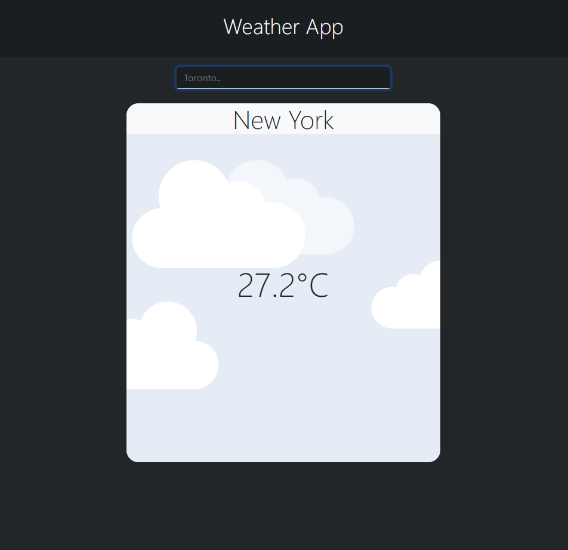

# Weather-app
Welcome to my wether application!
In this project you will be able to get the weather information on any city by submitting the city name!
This uses the accuweather api and retrieves all data necessary and displays it on screen.

## Demo

